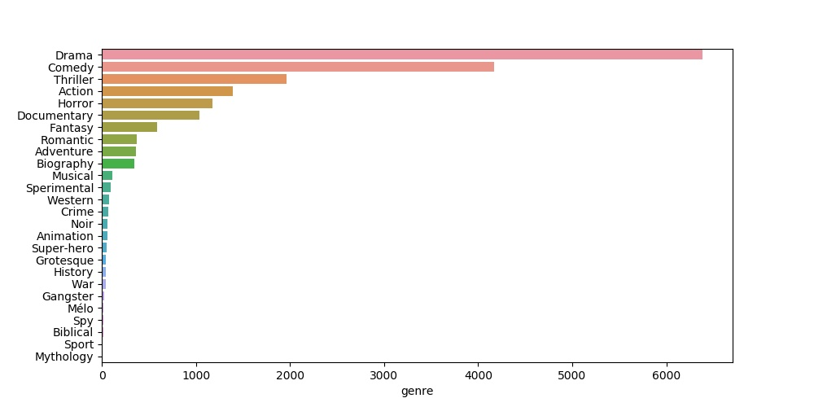
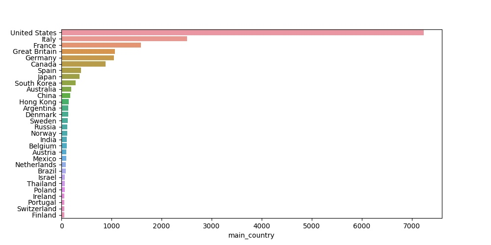
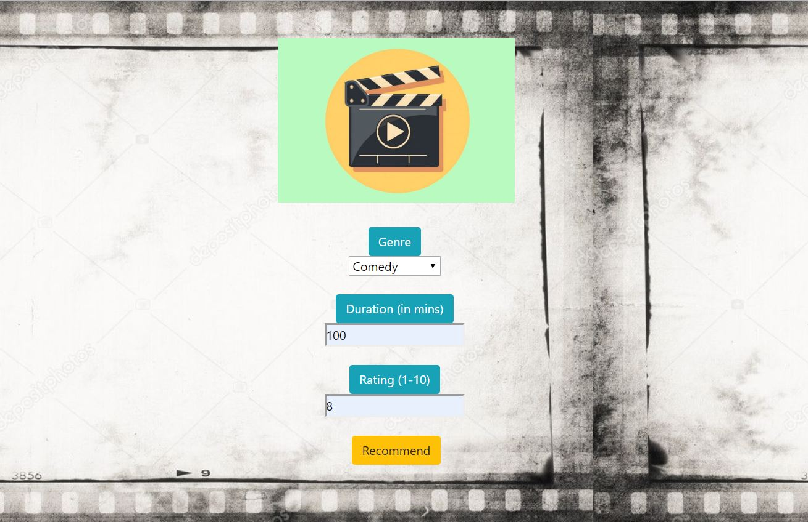

# US-Film Recommendation
### A Film A Day, Make Your Boredom Flies Away

#
**1. Introduction**

This app aims to give top 3 US- film recommendation based on user's input of genre, duration and rating.

#
**2. Dataset**

The dataset used in this analysis can be found [here (Kaggle)](https://www.kaggle.com/stefanoleone992/filmtv-movies-dataset), which contains **almost 47k rows** of observation. Data recorded dated back from film released in 1912 to 2018.

#
**3. Data Preparation**

In preparing the data, the major considerations within the process of data cleansing is the existence and proportion of na values in each variable. The result of data cleansing can be seen below:

column | sum of na values
--- | ---
filmtv_ID | 0
film_title | 0
year | 0
genre | 171
duration | 0
country | 39
main_country | 39
director | 3
actors | 129
avg_vote | 0
votes | 0

Since the total number of observations with na values is very small, even less than 1% of total observations, so it is assumed to be justifiable to remove all this na-existing observations from the data.

#
**4. Data Insights**

When the data is ready, a quick analysis with graph visualization is conducted to find out the distribution and proportion of data.

Data is analyzed with the **Genre** and **Country** as the main pivots, which is deemed to be the most important uniqueness for user with the results as following chart:



From the first chart, it can be seen that there data is heavily skewed to 'Drama' category, which has more than 6,000 observations followed by 'Comedy' category. In that sense, the model might give more relevant recommendations for those two genres but less relevants for the rest of genres.



From the Film Count by Country chart, it is shown that the number of US-based films are overwhelmingly dominating, even reaching more than 21,000 data inputs. US-films category itself can already be a good portion of smaller datasets to build and run the model, hence in the next process we are focusing on this category.


#
**5. Data Wrangling and Modelling**

Prior to building the model, several more steps of data wrangling is conducted.

The first one is dropping some variabels that are deemed to not have direct contribution to the model, which are filmtv_ID and votes.

The second one is minimizing the number of dependent variables and its observation as to make the model lighter to be run. In this step, I preserve only three main variables which are **genre**, **duration** and **average votes/rating**. I also limit the release year of the films to be later from 2000, simply due to *Memory Error* issue I encountered when trying to run with complete dataset.

From the process of data wrangling, the remaining number of observation is **7,697 rows**.


In building the model, 100% data is used for training instead of splitting it into testing data.

One-Hot Encoder is applied for creating dummy variable based on 26 different labels of genre category.

The method used for modelling is Decision Tree as it provides the highest number of accuracy and faster computation compared to other methods (Logistics Regression, Random Forest).

The final score of the model is as shown below:


```python
print(modelDT.score(dfX, dfY))
```

> 0.6970994475138121

#
**6. Recommendation with Content-based Filtering Method**

For running the app to get film recommendations, you could run the phyton file in terminal:

```bash
$ py app.py
```

The home page will show as followed:


Then the user can choose the genre and input the duration and rating based on their preference:



When they click recommend, the app will provide 3 US-films that user can watch next time:


**Happy Watching!**

